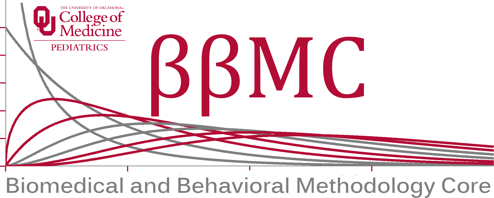
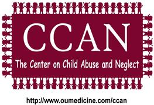
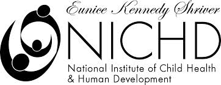
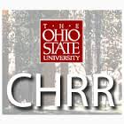

Investigators
=============================

*For a recent description of the current kinship link team (and also background and description of the overall projects), please see:*

Research Media Ltd. (November, 2013). [Family Ties and Kinship Links](https://github.com/nlsy-links/NlsyLinks/blob/master/vignettes/publications/2013/rodgers-2013-international-innovation.pdf).  *International Innovation*.

Vanderbilt University, Peabody College of Education, Department of Psychology and Human Development
-----------------------------

The PI, [Joe Rodgers](https://www.vanderbilt.edu/psychological_sciences/bio/joe-rodgers), recently retired as George Lynn Cross Research Professor Emeritus from the
[University of Oklahoma](https://www.ou.edu/) Department of [Psychology](https://www.ou.edu/cas/psychology/), and moved to Vanderbilt's [Peabody College of Education](https://peabody.vanderbilt.edu/), [Department of Psychology and Human Development](https://www.vanderbilt.edu/psychological_sciences/)
to direct the Quantitative Methods program.  For over 30 years he has been the coordinator of the NLSY Kinship Links project, and the PI on associated NIH grants.  Two Vanderbilt graduate students, [S. Mason Garrison](https://www.smasongarrison.com) and [Patrick O'Keefe](https://scholar.google.com/citations?user=7ir-hqAAAAAJ&hl=en), have been working on the project, along with many collaborators who originated at the University of Oklahoma.

Recent work on the NLSY Kinship links has been supported by NIH Grant R01-HD065865 (May 1, 2011 to December 31, 2014; Joe Rodgers, PI) and NIH Grant R01-HD087395 (May 1, 2017 to April 30, 2021). Previous kinship linking activity was supported by two previous NIH grants, the first in the 1990s, the second in the early 2000s.

<!--

-->

OUHSC Pediatrics
-----------------------------

The [Pediatrics Dept](https://medicine.ouhsc.edu/Academic-Departments/Pediatrics) of the University of Oklahoma [Health Sciences Center](https://www.ouhsc.edu/) z.  Current investigators are members of the [BBMC](https://ouhsc.edu/BBMC/) (Biomedical and Behavioral Methodology Core) and [CCAN](https://medicine.ouhsc.edu/Academic-Departments/Pediatrics/Sections/Developmental-Behavioral-Pediatrics/Patient-Care/Center-on-Child-Abuse-and-Neglect) (Center for Child Abuse and Neglect).

The participating members include David Bard and [Michael Hunter](https://acquia-prod.hhd.psu.edu/contact/michael-hunter).

<!--

-->

Howard Live Oak
-----------------------------

Howard Live Oak, LLC is a small consulting company specializing in custom software for data management and statistical analysis. Typical clients are small companies and research teams that would like gain a better understanding of systems manifesting in observed datasets.  It's participating member is [Will Beasley](https://www.researchgate.net/profile/William-Beasley-5).
<!--

-->

***
***

NLSY Administrators
=============================

Bureau of Labor Statistics (BLS)
-----------------------------

The [BLS](https://www.bls.gov/) was the first funding agency for the NLSY79.

<!--

-->

***
National Institute of Child Health and Human Development (NICHD)
-----------------------------

The [NICHD](https://www.nichd.nih.gov/) was the funding agency for the NLSY-Children/Young Adults.

<!--

-->

Center for Human Resources Research (CHRR)
-----------------------------

The [CHRR](https://www.chrr.ohio-state.edu/) is the data management arm who compiles, archives, and distributes the NLSY datasets.  CHRR has its own webpage, https://www.chrr.ohio-state.edu/

<!--

-->

National Opinion Research Center (NORC)
-----------------------------

[NORC](https://www.norc.org/) from the University of Chicago collects the NLSY data.

<!--

-->

Funding
=================================

This package’s development has been supported by two grants from NIH.  The first, NIH Grant [1R01HD65865](https://taggs.hhs.gov/Detail/AwardDetail?arg_awardNum=R01HD065865&arg_ProgOfficeCode=50), “NLSY Kinship Links: Reliable and Valid Sibling Identification” (PI: Joe Rodgers; Vignette Construction by Will Beasley) supported the (virtually) final completion of the NLSY79 and NLSYC/YA kinship linking files.  The second, NIH Grant [1R01HD087395](https://reporter.nih.gov/project-details/9239744), “New NLSY Kinship Links and Longitudinal/ Cross-Generational Models: Cognition and Fertility Research," (PI:  Joe Rodgers;  Vignette Construction by Will Beasley) is supporting the development of the NLSY97 kinship links, and slight updates/extensions in the links for the two earlier data sources.
